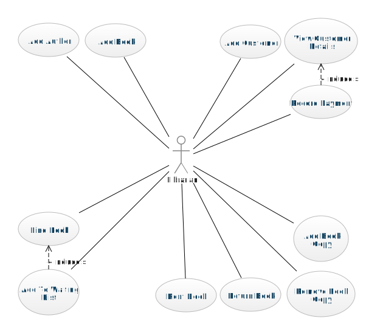
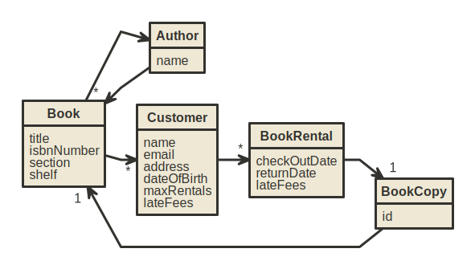

# Team Project: *Group 06*

This report details the work that was completed by together by all team members for the Requirements Analysis phase of the project.

## Team members

1. *Team member 1 - Yiming Lou (@LioshaLou)*
2. *Team member 2 - Mingwei Yan (@20205706)*
3. *Team member 3 - Jiahe Zhang (@ZhangJiahe)*
4. *Team member 4 - Feihe Huang (@20205735)*

# Requirements Analysis

This is the requirements analysis or business modelling for the library management system.

## Use Case Descriptions

The use case descriptions are separated into the categories of the parts of the system they relate to.

### The Library Catalog

1. [Add Author](01.add.author.md)
2. [Add Book](02.add.book.md)

### Customer Account Management

3. [Add Customer](03.add.customer.md)
4. [View Customer Details](04.view.customer.details.md)
5. [Record Payment](07.record.payment.md)

### Inventory Management

6. [Rent Book](05.rent.book.md)
7. [Return Book](06.return.book.md)
8. [Add Book Copy](08.add.book.copy.md)
9. [Remove Book Copy](09.remove.book.copy.md)

### Searching the Catalog

10. [Find Book](10.find.book.md)
11. [Add To Waiting List](11.add.to.waiting.list.md)

## Use Case Diagram

## Domain Model

## System Glossary

This is a definition of the important terms that are used in the documentation of the Library system.

| Term         | Description                                                                                                                              |
| -------------- | ------------------------------------------------------------------------------------------------------------------------------------------ |
| Book         | The record of a book recorded within the calalog of the library                                                                          |
| Book Copy    | Representation of an actual physical copy of a book that can be rented from the library. There may be multiple copies of the same books. |
| Customer     | The person renting and returning books from the library.                                                                                 |
| Book Rental  | The record of a book that was/is rented by a customer.                                                                                   |
| Late Fee     | A fee that is charged to the customer when a book is not returned by the expected return date.                                           |
| Waiting List | A list of customers who wish to rent a book when it is returned by another customer                                                      |
| librarian    | The name for  a staff member working at the library                                                                                      |

## Milestone 1 Requirements Analysis (Due 2022-10-21)

### Distribution of work on this phase

#### Use Cases and Other Items

| Item                                   | TM1  | TM2  | TM3 | TM4 | Notes on item | Percentage of whole task in this phase |
|------------------------~----------------| ------ | ------ | ----- | ----- | --------------- | ---------------------------------------- |
| Use Case Diagram                       | 50%  | 50%  |     |     |               | 12%                                    |
| Domain Model                           |      |      | 50% | 50% |               | 20%                                    |
| System Glossary                        |      |      | 50% | 50% |               | 20%                                    |
| Use Case 1: "Register"                 | 100% |      |     |     |               | 3%                                     |
| Use Case 2: "CheckRankingHistory"      | 100% |      |     |     |               | 3%                                     |
| Use Case 3: "CheckCurrentLateFees"     | 100% |      |     |     |               | 3%                                     |
| Use Case 4: "AddBook"                  | 100% |      |     |     |               | 3%                                     |
| Use Case 5: "DeleteBook"               | 100% |      |     |     |               | 3%                                     |
| Use Case 6: "AddAuthor"                | 100% |      |     |     |               | 3%                                     |
| Use Case 7: "DeleteAuthor"             | 100% |      |     |     |               | 3%                                     |
| Use Case 8: "RentingRecord"            |      | 100% |     |     |               | 3%                                     |
| Use Case 9: "ReturningRecord"          |      | 100% |     |     |               | 3%                                     |
| Use Case 10: "AddCustomerToWait"       |      | 100% |     |     |               | 3%                                     |
| Use Case 11: "AddCopy"                 |      | 100% |     |     |               | 3%                                     |
| Use Case 12: "DeleteCopy"              |      | 100% |     |     |               | 3%                                     |
| Use Case 13: "SetIdentifier"           |      | 100% |     |     |               | 3%                                     |
| Use Case 14: "SearchByAuthor"          |      | 100% |     |     |               | 3%                                     |
| Use Case 15: "BrowseListofAuthorBooks" |      | 100% |     |     |               | 3%                                     |
| Use Case 16: "SearchByTitle"           |      | 100% |     |     |               | 3%                                     |
| Use Case 17: "Record Payment"           |    100%  |  |     |     |               | 3%                                     |

#### Reflection Statements

| Team Member | Contribution Reflection Statement                                     |
| ------------- | ----------------------------------------------------------------------- |
| TM1         | Design the use case diagram, mainly write the use case description    |
| TM2         | Draw and modify the use case diagram, assist writing use cases        |
| TM3         | Designing the domain module, summarizing some of the system glossary. |
| TM4         | Draw the domain module, summarizing some of the system glossary.      |
