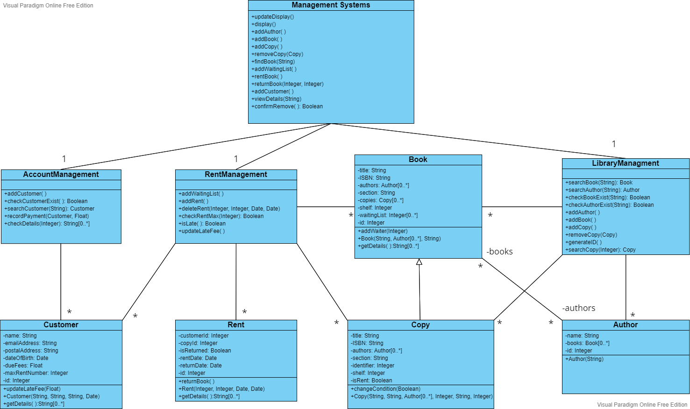

# Team Project: *Group 06*

This report details the work that was completed by together by all team members for the Requirements Analysis phase of the project.

## Team members

1. *Team member 1 - Yiming Lou (@LioshaLou)*
2. *Team member 2 - Mingwei Yan (@20205706)*
3. *Team member 3 - Jiahe Zhang (@ZhangJiahe)*
4. *Team member 4 - Feihe Huang (@20205735)*

# Analysis

This phase continues the development process by realising the courses of events that we described in the requirements analysis phase. This requires the creation of sequence diagrams for each course of events. Decisions made while constructing these diagrams are also documented in the class diagram.

## Use Case Realisations (Sequence Diagrams)

Each use case contains the separate sequence diagrams for each course of events. The diagrams are stored in the `images` folder and referenced in the markdown files.

1. [Add Author](01-AddAuthor.md)
2. [Add Book](01-AddBook.md)
3. [Add Customer](03-AddCustomer.md)
4. [View Customer Details](04-ViewCustomerDetails.md)
5. [Rent Book](05-RentBook.md)
6. [Return Book](06-ReturnBook.md)
7. [Record Payment](07-RecordPayment.md)
8. [Add Book Copy](08-AddBookCopy.md)
9. [Remove Book Copy](09-RemoveBookCopy.md)
10. [Find Book](10-FindBook.md)
11. [Add To Waiting List](11-AddToWaitingList.md)

## Class Diagram

The class diagram represents the information gained about the system by completing the use case realisations.

## Description of Responsibilities

### Book

The `Book` class is a basic entity class. It represents a type of book in the library. The sole responsibility of Book objects is to store the book's name, ISBN, authors, section, and its waiting customer and copies.

### Copy

The `Copy` class is a concrete subclass of class `Book`. It represents a specific copy of a type of book. The sole responsibility of Copy objects is to store the book's basic information and the rent condition of this copy.

### Customer

The `Customer` class is a basic entity class. It represents a real user that want to rent or return books in the library. The sole responsibility of Customer objects is to store the user's basic information such as username, mail address, post, due fees and how many books they rent etc.

### Author

The `Author` class is a basic entity class. It represents a real author. The sole responsibility of Author objects is to store the author's name and the book they've written.

### Rent

The `Rent` class is a basic entity class. It represents a rent record made by customers. The sole responsibility of Rent object is to store the customerId and copyId, together with the rent date and return date.

### ManagementSystem

The `ManagementSystem` class is a controller. It is responsible for receiving the primary request from user, while transferring data to the controllers on the next layer. It also has the method to display information and update information to the user.

### AccountManagement

The `AccountManagement` class is a controller. It is responsible for the operations related to the custome, including "add customer info" and "search for customer details".

### RentManagement

The `RentManagement` class a controller, which is responsible for rent operations. It will be called when the Management System send a renting or returning request.

### LibraryManagement

The `LibraryManagement` class is a controller. It is responsible for operations related to books, authors or copies. Therefore, the methods in this controller will be called when any request related to books is made.

## Milestone 2 Analysis (Due 2022-11-04)

### Distribution of work on this phase

#### Use Cases and Other Items

| Item                                | TM1  | TM2  | TM3  | TM4  | Notes on item                | Percentage of whole task in this phase |
| ------------------------------------- | ------ | ------ | ------ | ------ | ------------------------------ | ---------------------------------------- |
| Description of responsibilities     | 50%  | 50%  |      |      |                              | 12%                                    |
| Class Diagram                       | 50%  | 50%  |      |      |                              | 12%                                    |
| ReadMe                              | 50%  | 50%  |      |      |                              | 8%                                     |
| Use Case 1: "Add Author"            |      |      | 100% |      | Required 1 sequence diagrams | 6%                                     |
| Use Case 2: "Add Book"              |      |      | 100% |      | Required 1 sequence diagrams | 6%                                     |
| Use Case 3: "Add Customer"          |      |      |      | 100% | Required 2 sequence diagrams | 6%                                     |
| Use Case 4: "View Customer Details" |      |      |      | 100% | Required 1 sequence diagrams | 6%                                     |
| Use Case 5: "Rent Book"             | 100% |      |      |      | Required 2 sequence diagram  | 6%                                     |
| Use Case 6: "Return Book"           |      | 100% |      |      | Required 2 sequence diagram  | 6%                                     |
| Use Case 7: "Record Payment"        |      |      |      | 100% | Required 1 sequence diagram  | 6%                                     |
| Use Case 8: "Add Book Copy"         |      |      | 100% |      | Required 1 sequence diagram  | 6%                                     |
| Use Case 9: "Remove Book Copy"      |      |      | 100% |      | Required 2 sequence diagram  | 6%                                     |
| Use Case 10: "Find Book"            |      |      | 100% |      | Required 1 sequence diagram  | 6%                                     |
| Use Case 11: "Add To Waiting List"  | 50%  | 50%  |      |      | Required 1 sequence diagram  | 6%                                     |

#### Reflection Statements

| Team Member | Contribution Reflection Statement                                                                                                                          |
| ------------- | ------------------------------------------------------------------------------------------------------------------------------------------------------------ |
| TM1         | Responsible for designing and creating class diagram, writing the description of responsibilities, and modifying the logic details in sequence diagram.    |
| TM2         | Responsible for creating part of the sequence diagrams, description of responsibilities and writing ReadMe.md, while designing and creating class diagram. |
| TM3         | Mainly in charge of graphing the sequence diagram, assisting the accomplishment of the class diagram.                                                      |
| TM4         | Mainly in charge of graphing the sequence diagram, assisting the accomplishment of the class diagram.                                                      |
