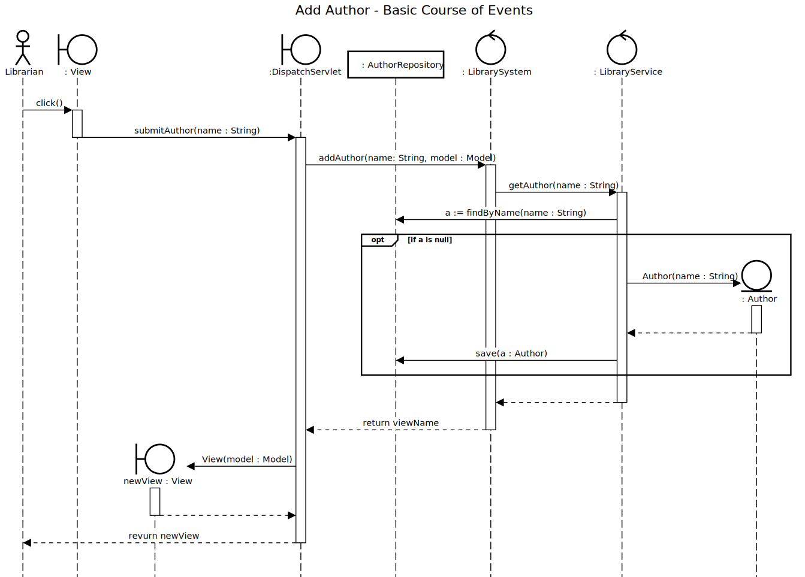

# Add Author

## 01 - Add Author
### Course of Events

1. The librarian starts the add author functionality.
2. The system displays an empty form for entering the author details.
3. The librarian enters the author details (name).
4. The author is added to the system and the main screen is displayed.

### Sequence Diagram

