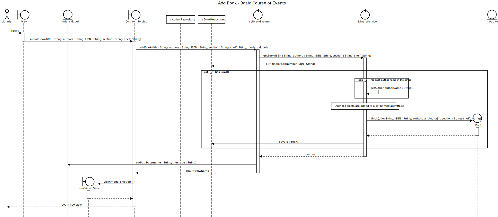

# Add Book

## 01 - Add Book

### Course of Events

1. The librarian starts the add book functionality.
2. The system displays an empty form for entering the book details.
3. The librarian enters the book details (title, authors, ISBN number).
4. The book is added to the system and the main screen is displayed.

### Sequence Diagram

