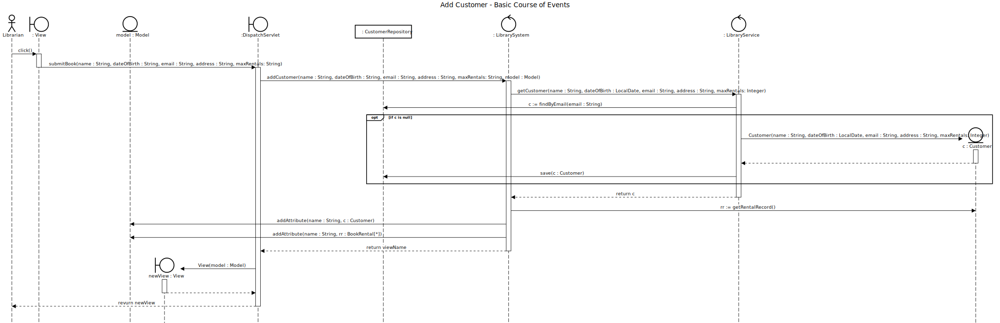

# Add Customer

## 01 - Add Customer

### Course of Events

1. The librarian starts the add customer functionality.
2. The system displays an empty form for entering the customer details.
3. The librarian enters the customer details (name, dob, email, address).
4. The system displays the newly created customer account.

### Sequence Diagram

