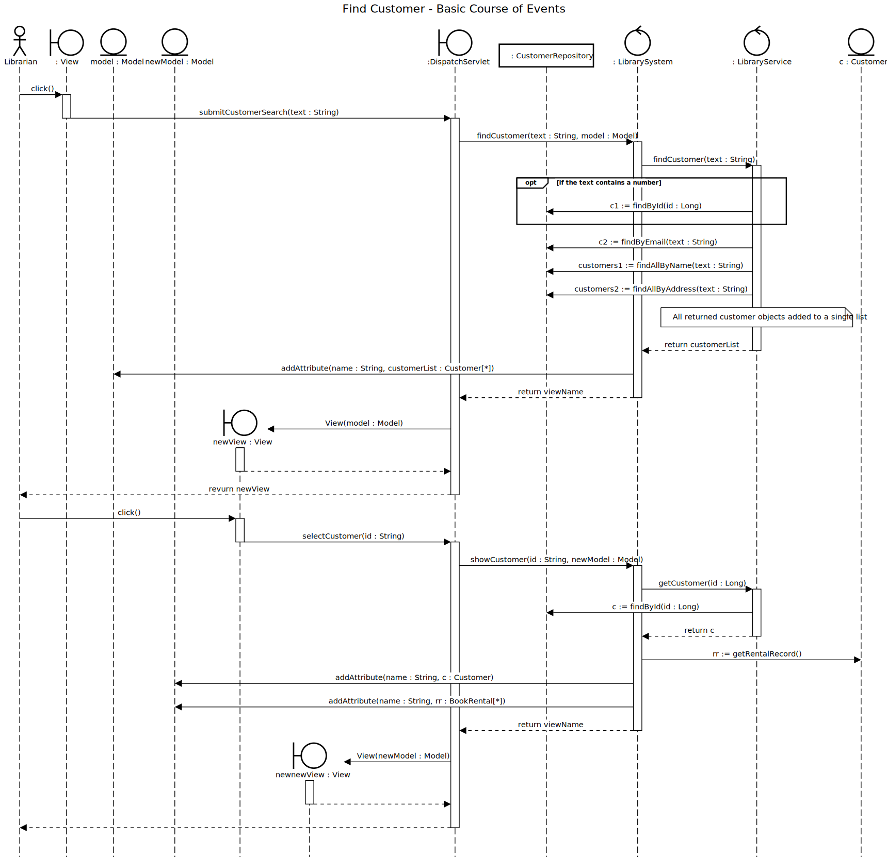
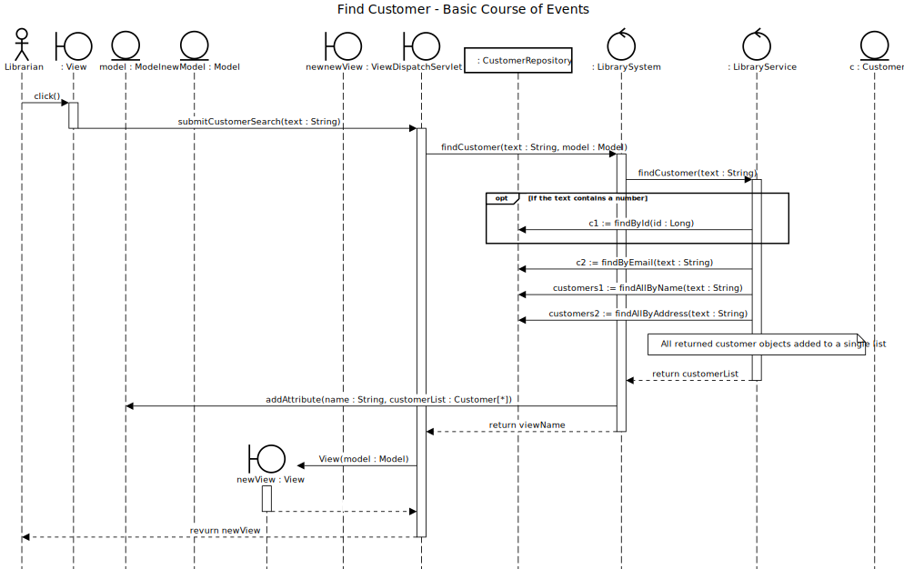

# View Customer Details

## 01 - View Customer Details

### Course of Events

1. The librarian starts the find customer functionality.
2. The system displays an empty form for entering the customer details.
3. The librarian enters some customer details such as id, name, dob, or email.
4. The system displays a list of customers matching the search criteria
5. The librarian selects the customer from the list.
6. The system displays the customer account details (rental record and currently rented books, fees due, name, email, address, dat of birth).

### Sequence Diagram

## 02 - Customer Not Found

### Course of Events

1. The librarian starts the find customer functionality.
2. The system displays an empty form for entering the customer details.
3. The librarian enters some customer details such as id, name, dob, or email.
4. The system displays a list of customers matching the search criteria
5. The librarian selects does not see the customer they were searching for and does not select a customer from the list.

### Sequence Diagram

