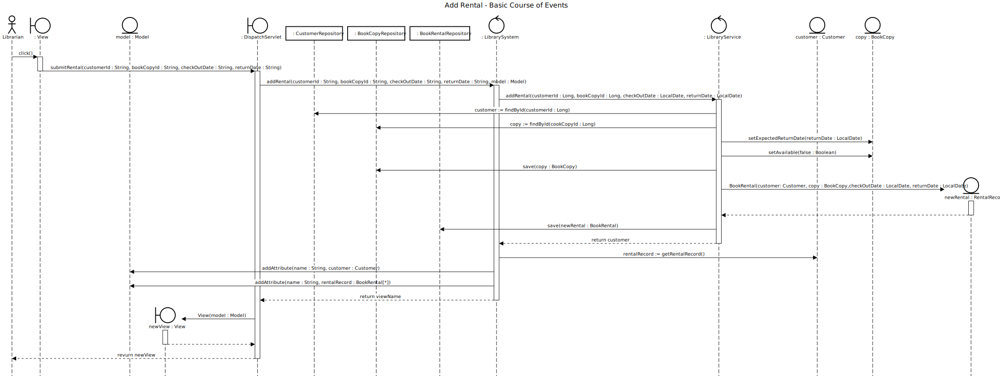

# Add Rental

## 01 - Add Rental

### Course of Events

1. The librarian starts the rent book functionality.
2. The system displays an input form for entering the customer and book copy details.
3. The librarian enters the customer id, book copy id, check out date, and return date.
4. The system displays the customer account with the book rental details.

### Sequence Diagram

## 02 - Maximum Rentals Reached

### Course of Events

1. The librarian starts the rent book functionality.
2. The system displays an input form for entering the customer and book copy details.
3. The librarian enters the customer id, book copy id, check out date, and return date.
4. The system warns that the user has already reached their maximum number of rentals. The system displays the customer account with the book rental details.

### Sequence Diagram

