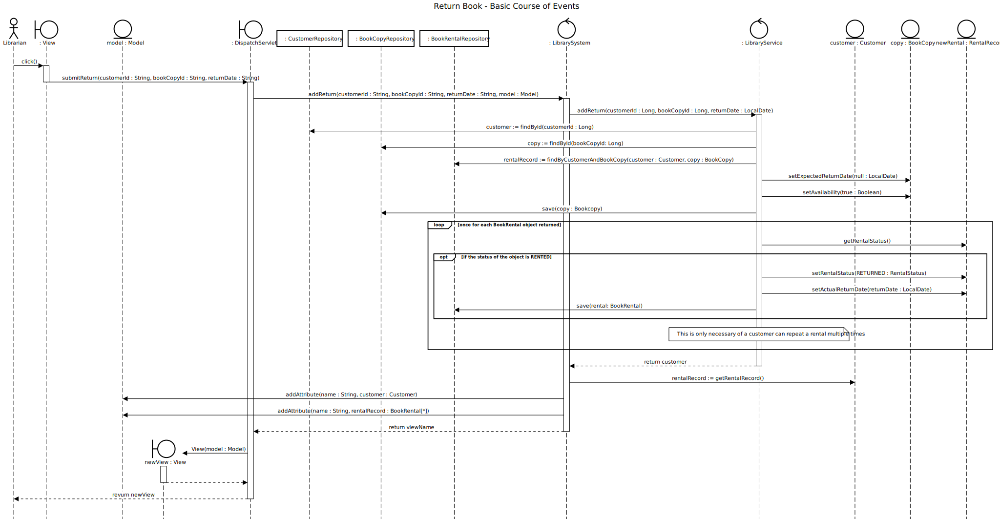
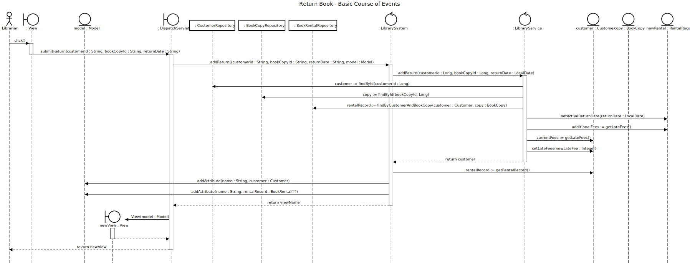

# Return Book

## 01 - Return Book

### Course of Events

1. The librarian starts the return book functionality.
2. The system displays an input form for entering the customer and book copy details.
3. The librarian enters the customer id, book copy id, return date.
4. The system displays the customer account with the book rental details.

### Sequence Diagram

## 02 - Late Fees

### Course of Events

1. The librarian starts the return book functionality.
2. The system displays an input form for entering the customer and book copy details.
3. The librarian enters the customer id, book copy id, return date.
4. The system displays the customer account with the book rental details where the late fees are updated to include the fee for this rental.

### Sequence Diagram

