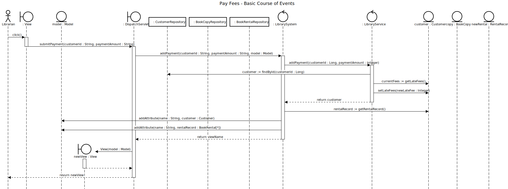

# Record Payment

## 01 - Record Payment

### Course of Events

1. The librarian performs the view customer details use case
2. The librarian start the make payment functionality
3. The system displays an empty form for entering the payment details
4. The librarian enters the payment details (amount)
5. The system displays the customer account details (rental record and currently rented books, fees due, name, email, address, dat of birth).

### Sequence Diagram

