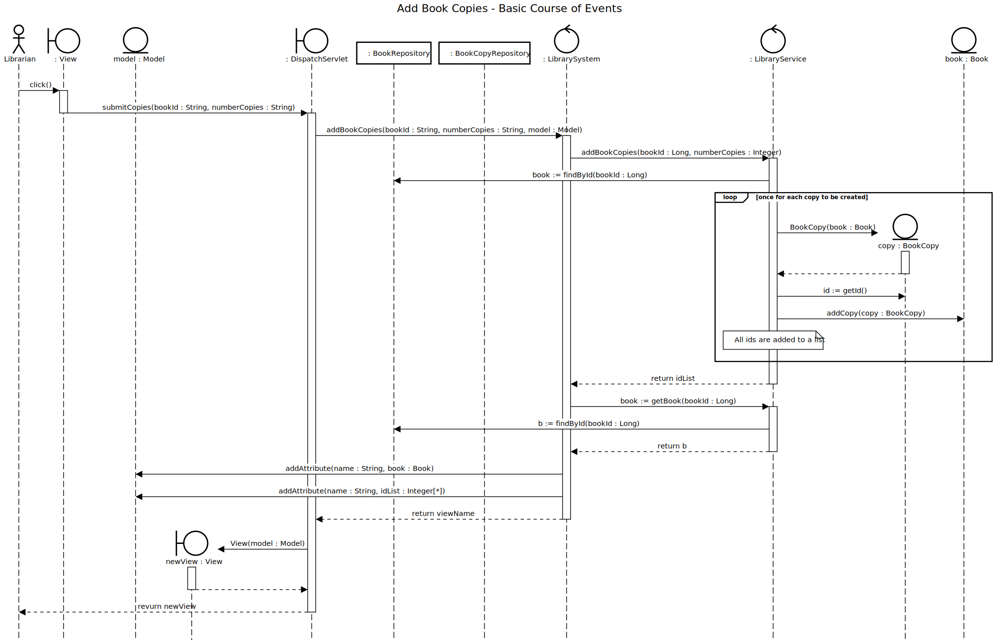

# Add Book Copy

## 01 - Add Book Copy

### Course of Events

1. The librarian starts the add book copy functionality.
2. The system displays an empty form for choosing the book and number of copies.
3. The librarian chooses the book and the number of copies.
4. The copies are added to the inventory and the generated ids are displayed. 

### Sequence Diagram

