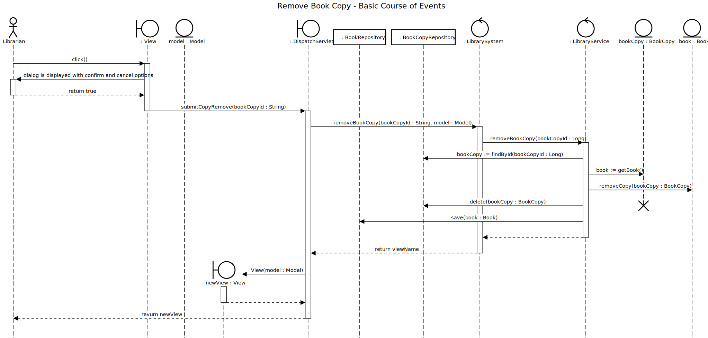
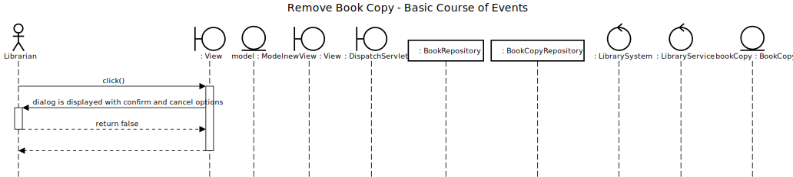

# Remove Book Copy

## 01 - Remove Book Copy

### Course of Events

1. The librarian starts the remove book copy functionality.
2. The system displays an empty form for entering the id of the book copy.
3. The librarian enters the id of the book copy.
4. The system prompts the librarian to confirm the removal of the book copy.
5. The librarian confirms the removal of the book copy.
6. The book copy is removed from the inventory. The system returns to the main screen.

### Sequence Diagram

## 02 - No Confirmation

### Course of Events

1. The librarian starts the remove book copy functionality.
2. The system displays an empty form for entering the id of the book copy.
3. The librarian enters the id of the book copy.
4. The system prompts the librarian to confirm the removal of the book copy.
5. The librarian doesn't confirm the removal of the book copy.
6. The system returns to the main screen.

### Sequence Diagram

