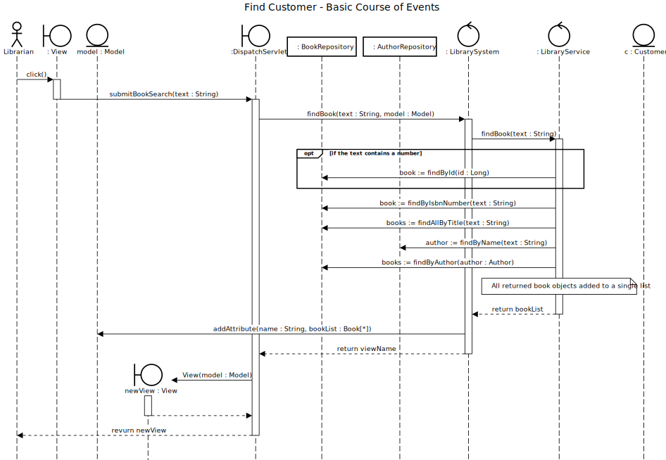

# Find Book

## 01 - Find Book

### Course of Events

1. The librarian starts the find book functionality.
2. The system displays an empty form for searching for a book.
3. The librarian enters the search details (title, author, ISBN, etc.).
4. The system displays the results on the screen (if any).

### Sequence Diagram

