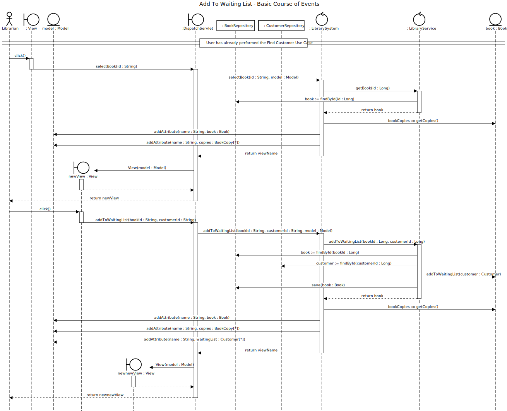

# Add to Waiting List

## 01 - Add to Waiting List

### Course of Events

1. The librarian completes the find book use case.
2. The librarian selects the book the user wants to rent.
3. The system displays the book details.
4. The librarian selects the add to waiting list functionality.
5. The system displays a form for entering the customer details.
6. The librarian enters the customer details (id number)
7. The system adds the customer to the waiting list for the book and displays the book details.

### Sequence Diagram

