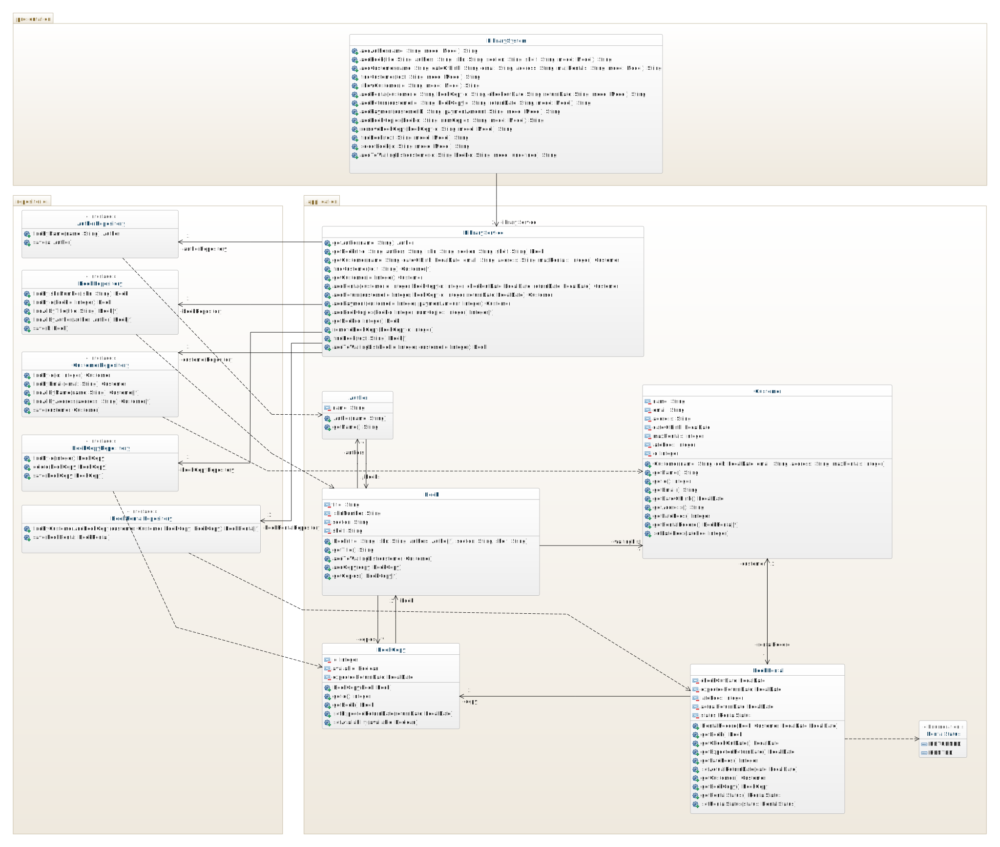

# Team Project: *Group 00*
This report details the work that was completed by together by all team members for the Design phase of the project.

## Team members
1. *Team member 1 - Seán Russell (@sean)*
1. *Team member 2 - Seán Russell (@sean)*
1. *Team member 3 - Seán Russell (@sean)*
1. *Team member 4 - Seán Russell (@sean)*

# Design

This phase continues the development process by realising the courses of events that we described in the requirements design phase. This requires the improvement of the existing sequence diagrams for each course of events. Decisions made while constructing these diagrams are also documented in the class diagram.

## Use Case Realisations (Sequence Diagrams)

Each use case contains the separate sequence diagrams for each course of events. The diagrams are stored in the `images` folder and referenced in the markdown files.

1. [Add Author](01-Add-Author.md)
2. [Add Book](02-Add-Book.md)
3. [Add Customer](03-Add-Customer.md)
4. [View Customer Details](04-View-Customer-Details.md)
5. [Add Rental](05-Add-Rental.md)
6. [Return Book](06-Return-Book.md)
7. [Record Payment](07-Record-Payment.md)
8. [Add Book Copy](08-Add-Book-Copy.md)
9. [Remove Book Copy](09-Remove-Book-Copy.md)
10. [Find Book](10-Find-Book.md)
11. [Add to Waiting List](11-Add-List.md)

## Class Diagram

The class diagram represents the information gained about the system by completing the use case realisations.

## Data Persistence
Within the restaurant the following classes should be maintained between executions.
1. Author - id, name
2. Book - id, title, ISBN, section, shelf, authors
3. BookCopy - id, book, available, expectedReturnDate
4. Customer - id, name, email, address, dateOfBirth, maxBooks, fees
5. BookRental - id, bookCopy, customer, rentalDate, expectedReturnDate, actualReturnDate, lateFee

### Relationships
1. Author - Book (* - *)
2. Book - BookCopy (1 - *)
3. BookCopy - BookRental (1 - 1)
4. Customer - BookRental (* - 1)
5. Book - Customer (1 - *)

### Constraints

1. Author - unique(name)
2. Book - unique(ISBN)
3. Customer - unique(email)

## Notes

There are some changes made to the sequence diagrams from the end of the recording. This is where I noted some inconsistencies after the recording but before the rest of the use cases were realised.
